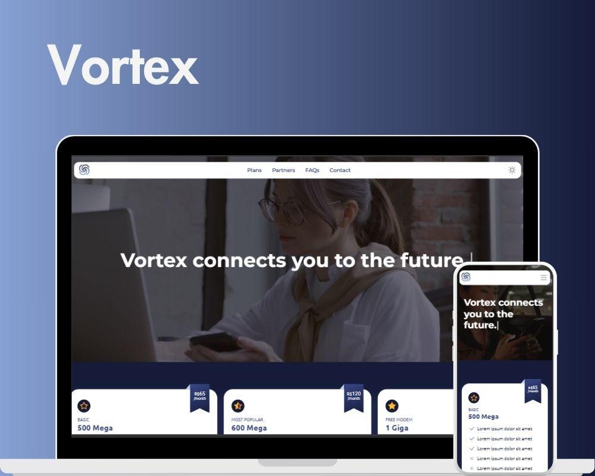

<h1 align="center"> Vortex </h1>

  <a href="#-tecnologias">Tecnologias</a>&nbsp;&nbsp;&nbsp;|&nbsp;&nbsp;&nbsp;
  <a href="#-projeto">Projeto</a>&nbsp;&nbsp;&nbsp;|&nbsp;&nbsp;&nbsp;
  <a href="#-licença">Licença</a>

  

 

  

## 🚀 Tecnologias

Esse projeto foi desenvolvido com as seguintes tecnologias:

- HTML e CSS
- JavaScript
- Git e Github

## 💻 Projeto

A página é uma landing page responsiva de uma empresa fictícia de serviços de internet. O site possui a seção home com uma animação typewriter, a seção de tabela de preços, um carrossel infinito, a seção de FAQs com accordions interativos e um formulário de contato.

## 📝 Licença

Esse projeto está sob a licença MIT.

---

Feito por Sullara Tavares